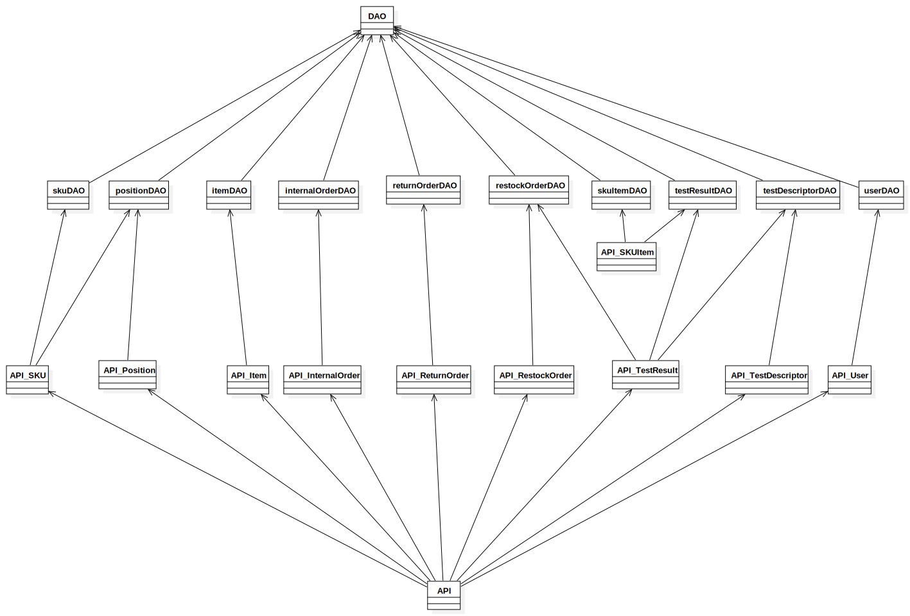

# Integration and API Test Report

Date: 25/05/2022

Version: 1.0

# Contents

- [Dependency graph](#dependency-graph)

- [Integration approach](#integration)

- [Tests](#tests)

- [Scenarios](#scenarios)

- [Coverage of scenarios and FR](#scenario-coverage)
- [Coverage of non-functional requirements](#nfr-coverage)

# Dependency graph 
Figure shows dependency graph of classes in the code
 

     
# Integration approach

Having only 2 layers of classes (excluding dao access one and the API wrapping one), the first part of tests is done using unit tests (see UnitTestReport), while the second one is done using API tests on Mocha. Therefore integration has been made using a bottom up approach.
    

#  Integration Tests

## Step 1 - See UnitTestReport
| Classes  | mock up used |Jest test cases |
|--|--|--|
|internalOrderDAO | - | see UnitTestReport|
|itemDAO          | - | see UnitTestReport|
|positionDAO      | - | see UnitTestReport|
|restockOrderDAO  | - | see UnitTestReport|
|returnOrderDAO   | - | see UnitTestReport|
|skuitemDAO       | - | see UnitTestReport|
|skuDAO           | - | see UnitTestReport|
|testDescriptorDAO| - | see UnitTestReport|
|testResultDAO    | - | see UnitTestReport|
|userDAO          | - | see UnitTestReport|

## Step 2
| Classes  |API test cases |
|:--:|:--:|
|API_InternalOrder|testAPI_InternalOrder|
|API_Item|testAPI_Item|
|API_Position|testAPI_Position|
|API_RestockOrder|testAPI_RestockOrder|
|API_ReturnOrder|testAPI_ReturnOrder|
|API_SKU|testAPI_SKU|
|API_SKUItem|testAPI_SKUItem|
|API_TestDescriptor|testAPI_TestDescriptor|
|API_TestResult|testAPI_TestResult|
|API_User|testAPI_User|

# Coverage of Scenarios and FR

<Report in the following table the coverage of  scenarios (from official requirements and from above) vs FR. 
Report also for each of the scenarios the (one or more) API Mocha tests that cover it. >  Mocha test cases should be here code/server/test

| Scenario ID | Functional Requirements covered | Mocha  Test(s) | 
| :---------: | :----: | :-------------------: | 
|  1-1        | FR2.1  | testAPI_SKU           |
|             | FR2.2  | testAPI_SKU           |
|             | FR2.3  | testAPI_SKU           |
|  2-1        | FR3.1.1| testAPI_Position      |
|  2-3        | FR3.1.4| testAPI_Position      |
|  2-4        | FR3.1.4| testAPI_Position      |
|  2-5        | FR3.1.2| testAPI_Position      |
|             | FR3.1.3| testAPI_Position      |
|  3-1        | FR5.1  | testAPI_RestockOrder  |
|  4-1        | FR1.1  | testAPI_User          |
|  4-2        | FR1.5  | testAPI_User          |
|  4-3        | FR1.2  | testAPI_User          |
|  5-2-1      | FR5.8.2| testAPI_TestResult    |
|  5-2-2      | FR5.8.2| testAPI_TestResult    |
|  5-2-3      | FR5.8.2| testAPI_TestResult    |
|  6-2        | FR5.10 | testAPI_ReturnOrder   |
|  7-1        |        | testAPI_User          |
|  7-2        |        | testAPI_User          |
|  9-1        | FR6.7  | testAPI_InternalOrder |
|  9-2        | FR6.7  | testAPI_InternalOrder |
|  9-3        | FR6.7  | testAPI_InternalOrder |
|  10-1       | FR6    | testAPI_InternalOrder |
|  11-1       | FR7    | testAPI_Item          |
|  11-2       | FR7    | testAPI_Item          |
|  12-1       | FR3.2.1| testAPI_TestDescriptor|
|  12-2       | FR3.2.2| testAPI_TestDescriptor|
|  12-3       | FR3.2.3| testAPI_TestDescriptor|

# Coverage of Non Functional Requirements

<Report in the following table the coverage of the Non Functional Requirements of the application - only those that can be tested with automated testing frameworks.>

### 

| Non Functional Requirement |  Test name       |
| -------------------------- | ---------------- |
|            NFR3            | testAPI_User     |
|            NFR4            | testAPI_Position |
|            NFR6            | testAPI_SKUItem  |
|            NFR9            | testAPI_SKUItem  |

