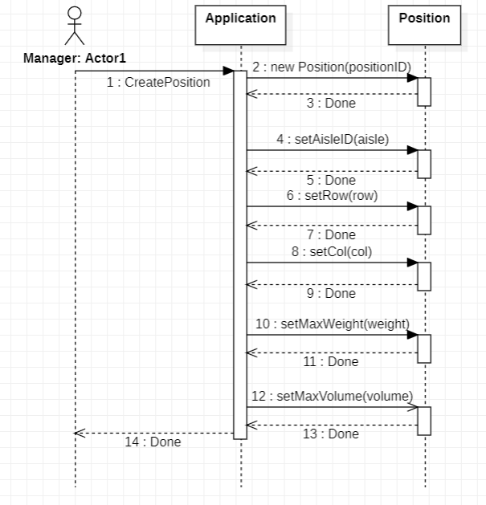
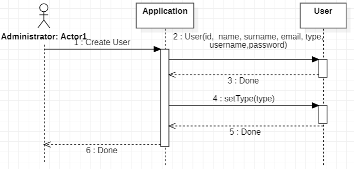

# Design Document 

Authors: Giuseppe Ciacco, Pietro Bertorelle, Mohamed Motrash, Elena Roncolino

Date: 
- 27-04-2022 v1.0
- 25-05-2022 v2.0 (updated)
- 05-06-2022 v3.0 (updated)

Version: 1.0

# Contents

- [High level design](#package-diagram)
- [Low level design](#class-diagram)
- [Verification traceability matrix](#verification-traceability-matrix)
- [Verification sequence diagrams](#verification-sequence-diagrams)

# Instructions

The design must satisfy the Official Requirements document, notably functional and non functional requirements, and be consistent with the APIs

# Package diagram

  

EZWH is a software application that includes three main packages:

- The *data* package handles the connection and operations with the database and the contains the classes to create the needed objects.
- The *application* package is responsible for the logic of the whole application. It queries the database and handles the returned result.
- The *gui* package contains the classes for implementing the user interface. (Note: this package is represented just for completeness and clarity of the diagram but will not be implemented)

The EZWH application follows both the *MVC (Model-View-Controller) model* since it store, modifies and updates data, and the *3-tier pattern* since it is divided into a data layer (the DB), an application layer and a presentation layer.

# Class diagram (v1.0)
Class diagram focuses on backend part of the software. Each API call is mapped to a facade method.
  

EZWH uses the façade design pattern since it provides a simple GUI with which the user can interact with the system, thus hiding the complexity of the mechanisms needed to make the application work. The singleton pattern is also used to ensure that only one instance of the database is created.

# Class diagram (v2.0)
V1.0 of design has been made using a Java-like class structure, with getters and setters and strict class structure.
Since the code has been written in JS, getters and setters are not included in classes definitions and code has been structured in 2 main layers as shown in the dependency graph
 
Overall structure is still the same, but APIs are organized in separate classes. Methods of DAO classes correspond to methods of v1.0 (except for setters and getters)

# Class diagram (v3.0)
In v3.0 test cases have been integrated in the project.

For the sake of readability, arrows from each class in the *unit-test* folder to the corresponding DAO class has been omitted (for example *internalOrderDAO.test* class should be connected to the class *internalOrderDAO* in the DB package).

# Verification traceability matrix (based on v1)

 

# Verification sequence diagrams (based on v1)
Sequence diagrams don't show in an explicit way HTTP calls and response, going to and coming from the application at the beginning/end of the sequence. Specific calls are written before the diagram. 
## Sequence Diagram of Scenario 1 UC1 
POST /api/sku
 

## Sequence Diagram of Scenario 2 UC2 
POST /api/position
 

## Sequence Diagram of Scenario 3 UC3 
POST /api/restockOrder
 

## Sequence Diagram of Scenario 4 UC4 
POST /api/newUser
 

## Sequence Diagram of Scenario 5.1 UC5.1
POST /api/testDescriptor
 

## Sequence Diagram of Scenario 5.3 UC5.3 
PUT /api/position/:positionID
PUT /api/restockOrder/:id
 

## Sequence Diagram of Scenario 6 UC6 
 

## Sequence Diagram of Scenario 7 UC7 
 

## Sequence Diagram of Scenario 9 UC9 
POST /api/internalOrders
PUT  /api/internalOrders/:id
  

## Sequence Diagram of Scenario 10 UC10 
PUT  /api/internalOrders/:id
 
