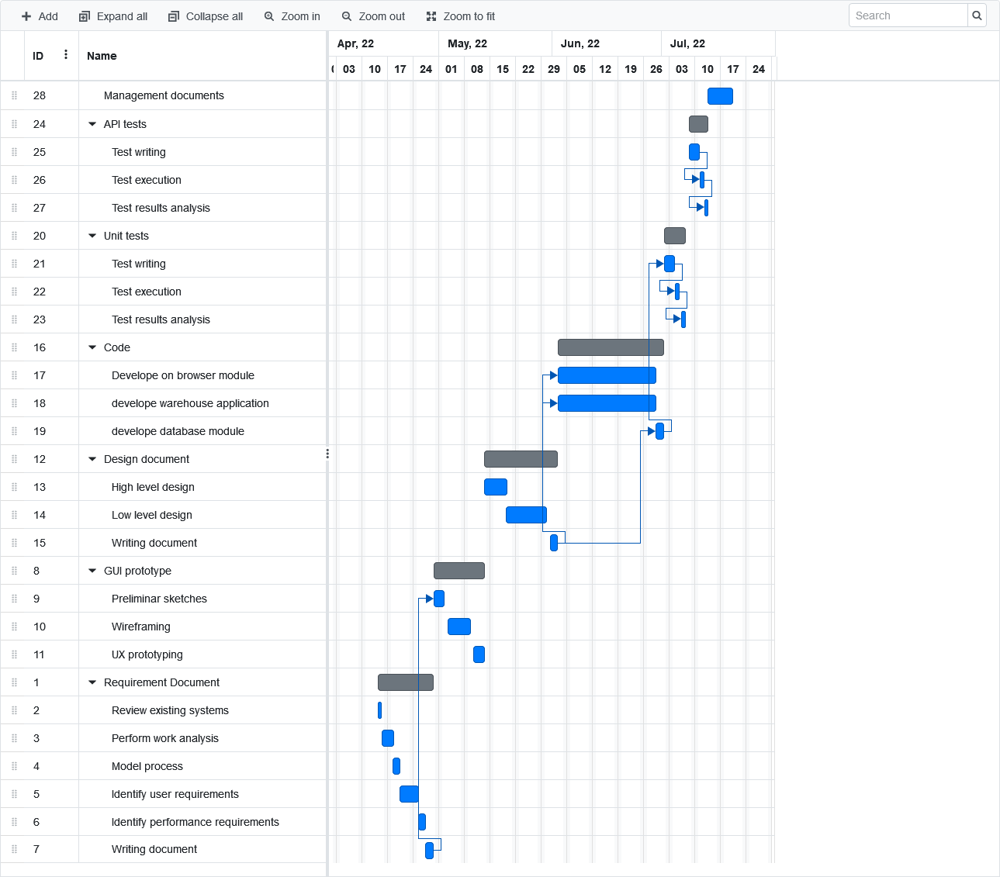

# Project Estimation  
Date:

Version: 0.1

# Estimation approach
Consider the EZWH  project as described in YOUR requirement document, assume that you are going to develop the project INDEPENDENT of the deadlines of the course
# Estimate by size
### 
|             | Estimate                        |             
| ----------- | ------------------------------- |  
| NC =  Estimated number of classes to be developed   |                        25 Classes|             
|  A = Estimated average size per class, in LOC       |         270  LOC                 | 
| S = Estimated size of project, in LOC (= NC * A) |6750 LOC|
| E = Estimated effort, in person hours (here use productivity 10 LOC per person hour)  |                        675 ph              |   
| C = Estimated cost, in euro (here use 1 person hour cost = 30 euro) | 20250 eur| 
| Estimated calendar time, in calendar weeks (Assume team of 4 people, 8 hours per day, 5 days per week ) |             4.2 Calendar weeks        |               

# Estimate by product decomposition
### 
|         component name    | Estimated effort (person hours)   |             
| ----------- | ------------------------------- | 
| Requirement document |120|
| GUI prototype |60|
| Design document |120|
| Code |320|
| Unit tests |30|
| API tests |30|
| Management documents  |40|

# Estimate by activity decomposition
### 
|         Activity name    | Estimated effort (person hours)   |             
| ----------- | ------------------------------- | 
| - __Requirement Document__ -                  |115|
| Review existing systems                       |10|
| Perform work analysis                         |15|
| Model process                                 |20|
| Identify user requirements                    |30|
| Identify performance requirements             |20|
| Writing document                              |20|
| - __GUI prototype__ -                         |80|
| Preliminar sketches                           |10|
| Wireframing                                   |40|
| UX prototyping                                |30|
| - __Design document__ -                       |120|
| High level design                             |40|
| Low level design                              |60|
| Writing document                              |20|
| - __Code__ -                                  |320|
| Develop browser module                        |150|
| Develop warehouse application                 |150|
| Develop database module                       |20|
| - __Unit tests__ -                            |30|
| Test writing                                  |10|
| Test execution                                |10|
| Test results analysis                         |10|
| - __API tests__ -                             |30|
| Test writing                                  |10|
| Test execution                                |10|
| Test results analysis                         |10|
| - __Management documents__ -                  |40|

# Summary

The estimation by size is the least precise because the approximation of 10 LOC per person hour is not precise and also the LOC per class is a rough approximation.
The estimate by product decomposition is more precise and the result is similar to the one by activity decomposition because the last one is a more detailed description.

|             | Estimated effort                        |   Estimated duration |          
| ----------- | ------------------------------- | ---------------|
| estimate by size |675|4.2 week calendar
| estimate by product decomposition |720| 4.5 week calendar
| estimate by activity decomposition |735| 4.5 week calendar

