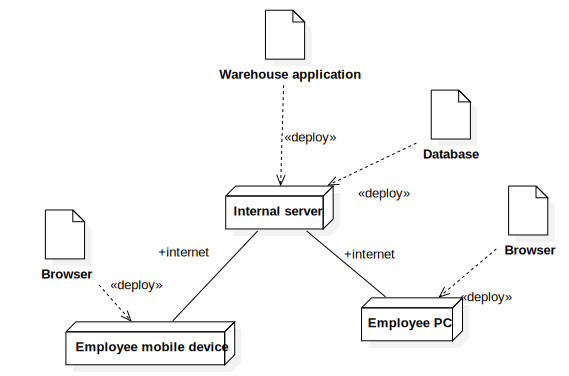

#Requirements Document 

Date: 08 april 2022

Version: 1.0

 
| Version number    | Change            |
| ----------------- |:------------------|
| 0.1.1             |Stakeholders completed| 
| 0.2.0             |FR - Glossary - Depl. Diag |
| 0.3.0             |UC - UC Diagram - Cont Diag - Interfaces|
| 0.4.0             |Merging changes from other branches - Updated diagrams|
| 1.0               |Merged different versions|
| 1.1				|Consistency check|
| 1.2               |Access rights|

# Contents

- [Informal description](#informal-description)
- [Stakeholders](#stakeholders)
- [Context Diagram and interfaces](#context-diagram-and-interfaces)
	+ [Context Diagram](#context-diagram)
	+ [Interfaces](#interfaces) 
	
- [Stories and personas](#stories-and-personas)
- [Functional and non functional requirements](#functional-and-non-functional-requirements)
	+ [Functional Requirements](#functional-requirements)
	+ [Non functional requirements](#non-functional-requirements)
- [Use case diagram and use cases](#use-case-diagram-and-use-cases)
	+ [Use case diagram](#use-case-diagram)
	+ [Use cases](#use-cases)
    	+ [Relevant scenarios](#relevant-scenarios)
- [Glossary](#glossary)
- [System design](#system-design)
- [Deployment diagram](#deployment-diagram)

# Informal description
Medium companies and retailers need a simple application to manage the relationship with suppliers and the inventory of physical items stocked in a physical warehouse. 
The warehouse is supervised by a manager, who supervises the availability of items. When a certain item is in short supply, the manager issues an order to a supplier. In general the same item can be purchased by many suppliers. The warehouse keeps a list of possible suppliers per item. 

After some time the items ordered to a supplier are received. The items must be quality checked and stored in specific positions in the warehouse. The quality check is performed by specific roles (quality office), who apply specific tests for item (different items are tested differently). Possibly the tests are not made at all, or made randomly on some of the items received. If an item does not pass a quality test it may be rejected and sent back to the supplier. 

Storage of items in the warehouse must take into account the availability of physical space in the warehouse. Further the position of items must be traced to guide later recollection of them.

The warehouse is part of a company. Other organizational units (OU) of the company may ask for items in the warehouse. This is implemented via internal orders, received by the warehouse. Upon reception of an internal order the warehouse must collect the requested item(s), prepare them and deliver them to a pick up area. When the item is collected by the other OU the internal order is completed. 

EZWH (EaSy WareHouse) is a software application to support the management of a warehouse.

# Stakeholders

| Stakeholder name        | Description                                                                         |
| ----------------------- |:-----------------------------------------------------------------------------------:|
|Company/Retailer         |Customers for EZWH application                                                       |
|Manager                  |Supervises warehouse (availability of items) for a Company/Retailer and issues orders|
|Suppliers                |Manage issue orders                                                       |
|Quality office	          |Performs quality checks on items                                                     |
|Warehouse employees      |Other employees working in the warehouse|
|Organizational units (OU)|Other parts of the company                                                |
|Competitors              |                                                                          |

# Context Diagram and interfaces

## Context Diagram
  

## Interfaces

| Actor | Logical Interface | Physical Interface  |
| ------------- |:-------------:| -----:|
|   Warehouse employee        | GUI | Mobile device (screen, camera)  |
|   Manager                   | GUI | PC (Keyboard, mouse, screen, camera) |
|   Quality office employee   | GUI | PC (Keyboard, mouse, screen, camera) |
|   Organizational units (OU) | GUI | PC (Keyboard, mouse, screen) |

# Stories and personas

## Personas
* __Persona1:__ Mary, 29 years old, warehouse employee. Mary's job is to store item, register their position and retrieve items when needed.    

* __Persona2:__ Josephine, 35 years old, warehouse manager, Josephine's job is to check the availability of items, make orders, review quality checks, manage the availability of free space in the warehouse.    

* __Persona3:__ Mark, 25 years old, quality office employee. Mark's job is to check the quality of products stored in the warehouse.   

## Stories
* __Story1:__ it's the start of the week and Mary's first task is to __check whether internal orders have been made__ and, if so, to retrieve the requested items and bring them to the drop off point. If all the orders have been taken care of, she __checks for newly arrived products__ bought from suppliers and places them in the correct location in the warehouse.
* __Story2:__ it's Thursday afternoon. Like every afternoon, Josephine __checks for item shortages__ in the warehouse. In case of low quantity for some item, she __selects the suppliers__ selling these items and __places an order__ to one of the suppliers.
* __Story3:__ it's Wednesday morning. Mark randomly __selects an item from the warehouse__ and tests its quality. After the test, he __writes a report__ stating whether the item met the quality requirements or it has to be rejected and __sent back to the supplier__.

# Functional and non functional requirements

## Functional Requirements

| ID        | Description  |
| ------------- |:-------------:| 
|  FR1     | Manage items in warehouse |
|  FR1.1   | Add item to warehouse|
|  FR1.2   | Update item quantity in warehouse |
|  FR1.3   | Remove item from warehouse|
|  FR1.4   | Search for item in the warehouse|
|  FR1.5   | Get item availability |
|  FR1.6   | Get list of suppliers |
|  FR1.7   | Get item quality check reports |
|  FR1.8   | Update space occupied by item|
|  FR1.9   | Create item descriptor|
|  FR2     | Manage quality checks |
|  FR2.1   | Create quality check report |
|  FR2.2   | Update quality check report |
|  FR2.3   | Delete quality check report |
|  FR3     | Manage users|
|  FR3.1   | Create account |
|  FR3.2   | Update account privileges|
|  FR3.3   | Manage log-in operations|
|  FR4     | Manage internal orders |
|  FR4.1   | Create internal order |
|  FR4.2   | Update internal order |
|  FR4.3   | Get pending internal orders|
|  FR5     | Manage external orders |
|  FR5.1   | Create external order |
|  FR5.2   | Update external order |
|  FR5.3   | Store invoice |
|  FR5.4   | Close external order |
|  FR5.5   | Get history of external orders|
|  FR6     | Manage item return request|
|  FR6.1   | Create item return request|
|  FR6.2   | Update item return request|
|  FR6.3   | Close item return request|
|  FR7     | Manage warehouse space|
|  FR7.1   | Add sector |
|  FR7.2   | Update sector |
|  FR7.3   | Delete sector |

### Access right, actor vs function

| Function | Manager | Warehouse Employee | Quality office employee | OU employee |
|:--------:|:-----:|:------------:|:-------:|:-----:|
| FR1   | yes | yes | no  | no  | 
| FR2   | no  | no  | yes | no  |
| FR3   | yes | no  | no  | no  |
| FR3.3 | yes | yes | yes | yes |
| FR4   | yes | no  | no  | no  |
| FR4.1 | yes | no  | no  | yes |
| FR4.2 | yes | yes | no  | no  |
| FR5   | yes | no  | no  | no  |
| FR5.2 | yes | yes | no  | no  |
| FR6   | yes | no  | no  | no  |
| FR6.2 | yes | yes | no  | no  |
| FR6.3 | yes | yes | no  | no  |
| FR7   | yes | no  | no  | no  |

 
## Non Functional Requirements

| ID        | Type (efficiency, reliability, ..)           | Description  | Refers to |
| ------------- |:-------------:| :-----:| -----:|
|  NFR1     | Efficiency | Database should be responsive (response time <1s for search operations) ||
|  NFR2     | Reliability| System reliability (<1‰ of wrong operations) |FR1, FR2, FR4, FR5, FR6 |
|  NFR3     | Availability| Database availability (no more than 1 day of downtime per month) | FR1, FR2, FR4, FR5, FR6|
|  NFR4     | Portability | Application should work on browsers for different devices ||
|  NFR5     | Security | System should be accessible only inside company without intruders access ||

# Use case diagram and use cases

## Use case diagram

 

### Use case 1, UC1 - Add item to warehouse
| Actors Involved        | Manager |
| ------------- |:-------------:| 
|  Precondition     | Item is not in system, manager is logged-in |
|  Post condition     | Item is in system |
|  Nominal Scenario     | Manager adds new item, manager sets item properties |
|  Variants     |  |
|  Exceptions   | Item already exists, error |

##### Scenario 1.1 

| Scenario 1.1 | |
| ------------- |:-------------:| 
|  Precondition     | Item is not in warehouse|
|  Precondition     | Manager is logged-in |
|  Post condition     | Item is added |
| Step#        | Description  |
|  1     | Manager creates a new item descriptor |  
|  2     | Manager sets item descriptor properties and ID |
|  3     | Manager adds item descriptor to warehouse |

### Use case 2, UC2 - Update item in warehouse

| Actors Involved        | Warehouse employee WE |
| ------------- |:-------------:| 
|  Precondition     | Item is in system, employee is logged-in |
|  Post condition     | Item quantity is updated |
|  Nominal Scenario     | WE scans barcode of item, WE updates quantity, WE updates space occupied by item|
|  Variants     |  |
|  Exceptions     | Barcode is not recognized -> error |

##### Scenario 2.1

| Scenario 2.1 | |
| ------------- |:-------------:| 
|  Precondition     | Item is in system|
|  Precondition     | Employee is logged-in |
|  Post condition     | Item quantity is updated |
| Step#        | Description  |
|  1     | WE picks operation (increase/decrease quantity) |  
|  2     | WE scans barcode using smartphone |
|  3     | Item is recognized from barcode |
|  4     | Item quantity is updated |
|  5     | WE selects warehouse sector|
|  6     | Sector space is updated|

### Use case 3, UC3 - Remove item from warehouse
| Actors Involved        | Manager |
| ------------- |:-------------:| 
|  Precondition     | Item I is in system, manager is logged-in |
|  Post condition     | Item is removed from warehouse |
|  Nominal Scenario     |  |
|  Variants     |  |
|  Exceptions     |  |

##### Scenario 3.1 

| Scenario 3.1 | |
| ------------- |:-------------:| 
|  Precondition     | Item I is in system|
|  Precondition     | Manager is logged-in |
|  Post condition     | Item is removed from warehouse |
| Step#        | Description  |
|  1     | Manager selects item descriptor from warehouse |  
|  2     | Manager selects remove action |
|  3     | System asks for confirmation |
|  4     | Manager confirms |
|  5     | Item descriptor is removed from warehouse |

### Use case 4, UC4 - Search for item in the warehouse
| Actors Involved        | Employee |
| ------------- |:-------------:| 
|  Precondition     | Employee E is logged in |
|  Post condition     | Employee E gets list of items |
|  Nominal Scenario     | Employee E searches for item in the system, system shows compatible items |
|  Variants     | Item is not present; search by item unique id|
|  Exceptions     | |

##### Scenario 4.1 

| Scenario 4.1 | |
| ------------- |:-------------:| 
|  Precondition     | Employee E is logged in |
|  Post condition     | Employee E gets the descriptor of the searched item |
| Step#        | Description  |
|  1     | Employee selects search functionality |  
|  2     | Employee cans the product bar code |
|  3     | System shows item descriptor |

### Use case 5, UC5 - Create quality check report
| Actors Involved        | Quality office employee |
| ------------- |:-------------:| 
|  Precondition     | Item I is in system, quality office employee QE is logged-in |
|  Post condition     | Quality check report QCR is created on item I |
|  Nominal Scenario     | QE searches for item type, QE selects unique ID of item, QE creates QCR on it |
|  Variants     | QE gets item scanning its barcode |
|  Exceptions     |  |

##### Scenario 5.1 

| Scenario 5.1 | |
| ------------- |:-------------:| 
|  Precondition     | Item I is in system |
|  Precondition     | Quality office employee (QE)is logged-in |
|  Post condition     | Quality check report (QCR) is created |
| Step#        | Description  |
|  1     | QE opens search functionality |
|  2     | QE enter the ID of the item that has to be tested |
|  3     | QE creates a QCR for the tested item  |

### Use case 6, UC6 - Update quality check report
| Actors Involved        | Quality office employee |
| ------------- |:-------------:| 
|  Precondition     | Quality check reports QCR exists, quality office employee QE is logged-in |
|  Post condition     | Quality check report QCR is updated |
|  Nominal Scenario     | QE searches for item, QE selects unique ID of item, QE selects QCR on it, updates QCR |
|  Variants     |  QE gets item scanning its barcode |
|  Exceptions     |  |

##### Scenario 6.1 

| Scenario 6.1 | |
| ------------- |:-------------:| 
|  Precondition     | QC of an item is in system |
|  Precondition     | Quality office employee (QE)is logged-in |
|  Post condition     | Quality check report (QCR) is updated |
| Step#        | Description  |
|  1     | QE opens search functionality |
|  2     | QE enter the ID of the item that has to be tested |
|  3     | QE opens the already present QCR  |
|  4     | QE updates QCR |

### Use case 7, UC7 - Delete quality check report
| Actors Involved        | Quality office employee |
| ------------- |:-------------:| 
|  Precondition     | Quality check reports Q exists, quality office employee QE is logged-in |
|  Post condition     | Quality check report Q is deleted |
|  Nominal Scenario     | QE searches for item, QE selects unique ID of item, selects QCR on it, deletes QCR |
|  Variants     |  QE gets item scanning its barcode |
|  Exceptions     | |

##### Scenario 7.1 

| Scenario 7.1 | |
| ------------- |:-------------:| 
|  Precondition     | QC of an item is in system |
|  Precondition     | Quality office employee (QE)is logged-in |
|  Post condition     | Quality check report (QCR) is deleted |
| Step#        | Description  | 
|  1     | QE opens search functionality |
|  2     | QE enter the ID of the item whose QCR has to be deleted |
|  3     | QE selects the QCT  |
|  4     | QE deletes QCR |

### Use case 8, UC8 - Create account
| Actors Involved        | Manager, warehouse employee, quality office employee, OU employee |
| ------------- |:-------------:| 
|  Precondition     | Account A does not exist for employee E, manager is logged in |
|  Post condition     | Account A is created for employee |
|  Nominal Scenario     | Manager starts account creation procedure, fills in data about employee, sets privileges for account|
|  Variants     | E is a quality office employee; E is an OU employee|
|  Exceptions     |  |

##### Scenario 8.1 

| Scenario 8.1 | |
| ------------- |:-------------:| 
|  Precondition     | Account A does not exist for employee E |
|  Precondition | Manager is logged in |
|  Post condition     | Account A is created for employee |
| Step#        | Description  |
|  1     | Manager opens page to create new account |
|  2     | Manager enters employee details and account privileges |
|  3     | Manager creates account |

### Use case 9, UC9 - Update account privileges
| Actors Involved        | Manager, warehouse employee, quality office employee, OU employee |
| ------------- |:-------------:| 
|  Precondition     | Account A exists for employee E |
|  Post condition     | Account A is updated |
|  Nominal Scenario     | Manager selects A to update; Manager updates privileges |
|  Variants     |  |
|  Exceptions     |  |

##### Scenario 9.1 

| Scenario 9.1 | |
| ------------- |:-------------:| 
|  Precondition     | Account A exists for employee E |
|  Precondition     | Manager is logged in |
|  Post condition     | Account A privileges are updated |
| Step#        | Description  |
|  1     | Manager searches the account to be changed |
|  2     | Manager updates account privileges |

### Use case 10, UC10 - Log-in
| Actors Involved        | Manager, warehouse employee, quality office employee, OU employee |
| ------------- |:-------------:| 
|  Precondition     | Employee E is registered, Employee is not logged in |
|  Post condition     | Employee E is logged in |
|  Nominal Scenario     | E fills in login data, system grants access |
|  Variants     |  |
|  Exceptions     | Login data is wrong, error |

##### Scenario 10.1 

| Scenario 10.1 | |
| ------------- |:-------------:| 
|  Precondition     | Employee E is registered |
|  Precondition     | Employee is not logged in |
|  Post condition     | Employee is logged in |
| Step#        | Description  |
|  1     | Employee navigates to login page |
|  2     | Employee types username and password |
|  3     | System checks correctness of credential and grants access to the system |

##### Scenario 10.2

| Scenario 10.2  | |
| ------------- |:-------------:| 
|  Precondition     | Employee E is registered |
|  Precondition     | Employee is not logged in |
|  Post condition     | Employee is shown error screen |
| Step#        | Description  |
|  1     | Employee navigates to login page |
|  2     | Employee types incorrect username and/or password |
|  3     | System does not grant access and shows error page |

### Use case 11, UC11 - Create internal order
| Actors Involved        | OU employee, manager |
| ------------- |:-------------:| 
|  Precondition     | OU employee is logged in |
|  Post condition     | Internal order is created |
|  Nominal Scenario     | OU starts internal order creation procedure; OU searches for items to add; OU sets quantity for items |
|  Variants     |  |
|  Exceptions     | Not enough items in warehouse |

##### Scenario 11.1

| Scenario 11.1  | |
| ------------- |:-------------:| 
|  Precondition     | OU employee is logged in |
|  Post condition     | Internal order is created |
| Step#        | Description  |
|  1     | Employee searches item  |
|  2     | Employee adds item to order chart |
|  3     | *Repeat steps 1 and 2 until all needed item are added to the order* |
|  4     | Employee places order |

### Use case 12, UC12 - Update internal order
| Actors Involved        | Manager |
| ------------- |:-------------:| 
|  Precondition     | Internal order IO exists, employee E is logged in |
|  Post condition     | Internal order IO is updated |
|  Nominal Scenario     | Manager selects IO; Manager changes IO status |
|  Variants     |  |
|  Exceptions     |  |

##### Scenario 12.1

| Scenario 12.1  | |
| ------------- |:-------------:| 
|  Precondition     | Internal order IO exists |
|  Precondition     | Manager E is logged in |
|  Post condition     | Internal order IO is updated |
| Step#        | Description  |
|  1     | Manager searches for order  |
|  2     | Manager modifies item quantity |
|  3     | Manager saves order |

##### Scenario 12.2

| Scenario 12.2  | |
| ------------- |:-------------:| 
|  Precondition     | Internal order IO exists |
|  Precondition     | Manager is logged in |
|  Post condition     | Internal order IO is updated |
| Step#        | Description  |
|  1     | Manager searches for order  |
|  2     | Manager updates order status |
|  3     | Manager saves order |

### Use case 13, UC13 - Create external order
| Actors Involved        | Manager, supplier |
| ------------- |:-------------:| 
|  Precondition     | Manager is logged in; item I can be ordered from supplier S|
|  Post condition     | External order EO is created |
|  Nominal Scenario     | Manager gets list of supplier for item; Manager selects supplier S; Manager creates EO for supplier S; Manager sets order properties|
|  Variants     | |
|  Exceptions     | Not enough space in the warehouse |

##### Scenario 13.1 

| Scenario 13.1 | |
| ------------- |:-------------:| 
|  Precondition     | Item I can be ordered from supplier S|
|  Precondition     | Item I is in the system |
|  Precondition     | Item I has got at least one supplier|
|  Precondition     | Manager is logged-in |
|  Post condition     | EO is sent to supplier |
| Step#        | Description  |
|  1     | Manager selects item I |
|  2     | System shows possible suppliers|
|  3     | Manager select supplier S|
|  4     | Manager creates EO on I for S|
|  5     | Manager sets required quantity for I|
|  6     | System checks for space requirements|
|  7     | Enough space in the warehouse |
|  6     | EO is sent to S|

##### Scenario 13.2 

| Scenario 13.2 | Exception |
| ------------- |:-------------:| 
|  Precondition     | Item I can be ordered from supplier S|
|  Precondition     | Item I is in the system |
|  Precondition     | Item I has got at least one supplier|
|  Precondition     | Manager is logged-in |
|  Post condition     | EO is sent to supplier |
| Step#        | Description  |
|  1     | Manager selects item I |
|  2     | System shows possible suppliers|
|  3     | Manager select supplier S|
|  4     | Manager creates EO on I for S|
|  5     | Manager sets required quantity for I|
|  6     | System checks for space requirements|
|  7     | Not enough space in the warehouse |
|  8     | EO creation procedure stops|

### Use case 14, UC14 - Update external order
| Actors Involved        | Manager, supplier |
| ------------- |:-------------:| 
|  Precondition     | External order EO exists, manager is logged in |
|  Post condition     | External order EO is updated |
|  Nominal Scenario     |  |
|  Variants     |  |
|  Exceptions     |  |

##### Scenario 14.1

| Scenario 14.1  | |
| ------------- |:-------------:| 
|  Precondition     | External order EO exists |
|  Precondition     | Manager is logged in |
|  Post condition     | External order EO is updated |
| Step#        | Description  |
|  1     | Employee searches for order  |
|  2     | Employee modifies item quantity |
|  3     | Employee saves order |

### Use case 15, UC15 - Close external order
| Actors Involved        | Manager |
| ------------- |:-------------:| 
|  Precondition     | External order EO exists, manager is logged in |
|  Post condition     | External order EO is closed |
|  Nominal Scenario     |  |
|  Variants     |  |
|  Exceptions     |  |

##### Scenario 15.1

| Scenario 15.1  | |
| ------------- |:-------------:| 
|  Precondition     | External order EO exists |
|  Precondition     | Manager is logged in |
|  Post condition     | External order EO is closed |
| Step#        | Description  |
|  1     | Manager searches for order  |
|  2     | Manager closes order |

### Use case 16, UC16 - Get history of external orders
| Actors Involved        | Manager |
| ------------- |:-------------:| 
|  Precondition     | Item I is in system, manager is logged in |
|  Post condition     | Manager gets history of external orders |
|  Nominal Scenario     | Manager selects item I; System shows history of external orders for item I |
|  Variants     | Item I has no previous external orders |
|  Exceptions     |  |

##### Scenario 16.1

| Scenario 16.1  | |
| ------------- |:-------------:| 
|  Precondition     | Item I is in system |
|  Precondition     | Manager is logged in |
|  Post condition     | Manager gets history of external orders |
| Step#        | Description  |
|  1     | Manager searches for an item  |
|  2     | Manager selects an item |
|  3     | Manager gets the history of external orders for the item |

### Use case 17, UC17 - Create item return request
| Actors Involved        | Manager, supplier |
| ------------- |:-------------:| 
|  Precondition     | External order EO is closed, item I didn't pass quality check, manager is logged in |
|  Post condition     | Item return request IRR is created |
|  Nominal Scenario     | Manager gets history of external orders for item I; Manager selects EO on item I; Manager selects quantity to return to supplier S |
|  Variants     | |
|  Exceptions     |  |

##### Scenario 17.1 

| Scenario 17.1 | |
| ------------- |:-------------:| 
|  Precondition     | External order EO is closed for item I|
|  Precondition     | Item I didn't pass quality check |
|  Precondition     | Manager is logged-in |
|  Post condition     | IRR is sent to supplier |
| Step#        | Description  |
|  1     | Manager gets history of external orders for item I |
|  2     | Manager selects EO from history|
|  3     | Manager selects quantity to return to S|
|  4     | Manager creates IRR on I|
|  5     | IRR is sent to S|

### Use case 18, UC18 - Update item return request
| Actors Involved        | Manager, supplier |
| ------------- |:-------------:| 
|  Precondition     | Item return request IRR exists, manager is logged in |
|  Post condition     | Item return request IRR is updated |
|  Nominal Scenario     |  |
|  Variants     | |
|  Exceptions     | |

##### Scenario 18.1

| Scenario 18.1  | |
| ------------- |:-------------:| 
|  Precondition     | Item return request IRR exists |
|  Precondition     | Manager is logged in |
|  Post condition     | Item return request IRR is updated |
| Step#        | Description  |
|  1     | Manager searches for IRR  |
|  2     | Manager selects IRR  |
|  2     | IRR is updated |

### Use case 19, UC19 - Close item return request
| Actors Involved        | Manager |
| ------------- |:-------------:| 
|  Precondition     | Item return request IRR exists, manager is logged in |
|  Post condition     | Item return request IRR is closed |
|  Nominal Scenario     |  |
|  Variants     |  |
|  Exceptions     |  |

##### Scenario 19.1

| Scenario 19.1  | |
| ------------- |:-------------:| 
|  Precondition     | Item return request IRR exists |
|  Precondition     | Manager is logged in |
|  Post condition     | Item return request IRR is updated |
| Step#        | Description  |
|  1     | Manager searches for IRR  |
|  2     | Manager selects IRR  |
|  2     | IRR is closed |

### Use case 20, UC20 - Add sector
| Actors Involved        | Manager |
| ------------- |:-------------:| 
|  Precondition     | Manager is logged-in |
|  Post condition     | Sector S added|
|  Nominal Scenario     | Manager adds new sector to warehouse, specifying its properties |
|  Variants     |  |
|  Exceptions     |  |

##### Scenario 20.1

| Scenario 20.1  | |
| ------------- |:-------------:| 
|  Precondition     | Manager is logged-in |
|  Post condition     | Sector S added|
| Step#        | Description  |
|  1     | Manager opens warehouse space management page  |
|  2     | Manager adds new sector  |
|  3     | Sector is added to warehouse|

### Use case 21, UC21 - Update sector
| Actors Involved        | Manager |
| ------------- |:-------------:| 
|  Precondition     | Sector S exists, Manager is logged-in |
|  Post condition     | Sector S is updated |
|  Nominal Scenario     |  |
|  Variants     |  |
|  Exceptions     |  |

##### Scenario 21.1

| Scenario 21.1  | |
| ------------- |:-------------:| 
|  Precondition     | Manager is logged-in |
|  Precondition     | Sector S exists |
|  Post condition     | Sector S updated|
| Step#        | Description  |
|  1     | Manager opens warehouse space management page  |
|  2     | Manager searches sector |
|  3     | Sector update sector details |
|  2     | Sector is updated |

### Use case 22, UC22 - Delete sector
| Actors Involved        | Manager |
| ------------- |:-------------:| 
|  Precondition     | Sector S exists, Manager is logged-in |
|  Post condition     | Sector S is deleted |
|  Nominal Scenario     |  |
|  Variants     |  |
|  Exceptions     | Sector cannot be deleted if products reference it |

##### Scenario 22.1

| Scenario 22.1  | |
| ------------- |:-------------:| 
|  Precondition     | Manager is logged-in |
|  Precondition     | Sector S exists |
|  Post condition     | Sector S is not deleted, error page is shown |
| Step#        | Description  |
|  1     | Manager opens warehouse space management page |
|  2     | Manager searches sector |
|  3     | Sector update sector details |
|  4     | Manager tries to deleted it |
|  5     | Error page is shown since sector cannot be deleted if there are items referencing it |

# Glossary

  

# System Design
No additional components are present in the system.
System includes EZWH application only

# Deployment Diagram 
  

