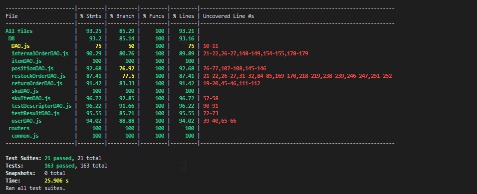

# Unit Testing Report

Date: 2022/05/25

Version: 1.1

# Contents

- [Black Box Unit Tests](#black-box-unit-tests)

- [White Box Unit Tests](#white-box-unit-tests)

# Black Box Unit Tests

Most of the test cases have been written as whitebox test cases, since most of the methods are methods working on the database and checks are done on higher levels.

 ### **Class *Common* - method *validateEmail***

**Criteria for method *validateEmail(emailAddress)*:**
	
 - C1: emailAddress is defined
 - C2: emailAddress contains `@`
 - C3: emailAddress contains dot `.`
 - C4: emailAddress TLD (top level domain) is correct (2-3 chars)
 - C5: emailAddress contains SLD (second level domain)
 - C6: emailAddress contains username

**Predicates for method *name*:**

| Criteria | Predicate |
| -------- | --------- |
|    C1    |C1 == true |
|          |C1 == false|
|    C2    |C2 == true |
|          |C2 == false|
|    C3    |C3 == true |
|          |C3 == false|
|    C4    |C4 == true |
|          |C4 == false|
|    C5    |C5 == true |
|          |C5 == false|
|    C6    |C6 == true |
|          |C6 == false|

**Combination of predicates**:

|C1|C2|C3|C4|C5|C6| Valid / Invalid | Description of the test case | Jest test case |
|:-:|:-:|:-:|:-:|:-:|:-:|:-:|:-:|:-:|
|F|F|F|F|F|F|I|emailAddress = undefined|VALIDATE_EMAIL
|T|F|F|F|F|F|I|emailAddress = `""`|VALIDATE_EMAIL
|T|F|F|F|F|T|I|emailAddress = `name`|VALIDATE_EMAIL
|T|F|F|F|T|F|I|emailAddress = `mail`|VALIDATE_EMAIL
|T|F|F|F|T|T|I|emailAddress = `namemail`|VALIDATE_EMAIL
|T|F|F|T|F|F|I|emailAddress = `it`|VALIDATE_EMAIL
|T|F|F|T|F|T|I|emailAddress = `nameit`|VALIDATE_EMAIL
|T|F|F|T|T|F|I|emailAddress = `mailit`|VALIDATE_EMAIL
|T|F|F|T|T|T|I|emailAddress = `namemailit`|VALIDATE_EMAIL
|T|F|T|F|F|F|I|emailAddress = `.`|VALIDATE_EMAIL
|T|F|T|F|F|T|I|emailAddress = `name.`|VALIDATE_EMAIL
|T|F|T|F|T|F|I|emailAddress = `mail.`|VALIDATE_EMAIL
|T|F|T|F|T|T|I|emailAddress = `namemail.`|VALIDATE_EMAIL
|T|F|T|T|F|F|I|emailAddress = `.it`|VALIDATE_EMAIL
|T|F|T|T|F|T|I|emailAddress = `name.it`|VALIDATE_EMAIL
|T|F|T|T|T|F|I|emailAddress = `mail.it`|VALIDATE_EMAIL
|T|F|T|T|T|T|I|emailAddress = `namemail.it`|VALIDATE_EMAIL
|T|T|F|F|F|F|I|emailAddress = `@`|VALIDATE_EMAIL
|T|T|F|F|F|T|I|emailAddress = `name@`|VALIDATE_EMAIL
|T|T|F|F|T|F|I|emailAddress = `@mail`|VALIDATE_EMAIL
|T|T|F|F|T|T|I|emailAddress = `name@mail`|VALIDATE_EMAIL
|T|T|F|T|F|F|I|emailAddress = `@it`|VALIDATE_EMAIL
|T|T|F|T|F|T|I|emailAddress = `name@it`|VALIDATE_EMAIL
|T|T|F|T|T|F|I|emailAddress = `@mailit`|VALIDATE_EMAIL
|T|T|F|T|T|T|I|emailAddress = `name@mailit`|VALIDATE_EMAIL
|T|T|T|F|F|F|I|emailAddress = `@.`|VALIDATE_EMAIL
|T|T|T|F|F|T|I|emailAddress = `name@.`|VALIDATE_EMAIL
|T|T|T|F|T|F|I|emailAddress = `@mail.`|VALIDATE_EMAIL
|T|T|T|F|T|T|I|emailAddress = `name@mail.abcd`|VALIDATE_EMAIL
|T|T|T|T|F|F|I|emailAddress = `@.it`|VALIDATE_EMAIL
|T|T|T|T|F|T|I|emailAddress = `name@.it`|VALIDATE_EMAIL
|T|T|T|T|T|F|I|emailAddress = `@mail.it`|VALIDATE_EMAIL
|T|T|T|T|T|T|V|emailAddress = `name@mail.it`|VALIDATE_EMAIL

# White Box Unit Tests

### Test cases definition

**NOTE 1:** Corresponding error cases (not written in the table since they correspond to the correct execution of the method) for class C (modules *C.test.js*) are tested in test modules *CErrors.test.js*

**NOTE 2:** Tests are written to work on different copies of the database for each test suite in order to avoid failures linked to concurrent accesses. For a safer (but slower) way of running them the option `--runInBand` needs to be added to the `npm test` command

|Class name| Unit name |Jest test suite| Jest test case | 
|--|--|--|--|
|internalOrderDAO|clear|internalOrderDAO|INTERNALORDER_0|
||getAllInternalOrders|internalOrderDAO|INTERNALORDER_1|
||getInternalOrdersState|internalOrderDAO|INTERNALORDER_2|
||getProducts|internalOrderDAO|INTERNALORDER_3|
||getProductsRfid|internalOrderDAO|INTERNALORDER_5|
||insertInternalOrder|internalOrderDAO|INTERNALORDER_1|
||deleteInternalOrder|internalOrderDAO|INTERNALORDER_6|
||modifyInternalOrder|internalOrderDAO|INTERNALORDER_4, INTERNALORDER_5|
|itemDAO|clear|itemDAO|ITEM_0|
||createNewItem|itemDAO|ITEM_1|
||getAllItems|itemDAO|ITEM_1|
||getItemById|itemDAO|ITEM_2|
||modifyItem|itemDAO|ITEM_3|
||deleteItem|itemDAO|ITEM_4|
|positionDAO|clear|testpositionDAO|POSITION_0|
||createPosition|testpositionDAO|POSITION_1|
||getAllPositions|testpositionDAO|POSITION_1|
||updatePositionID|testpositionDAO|POSITION_2|
||updateOccupiedPosition|testpositionDAO|POSITION_3|
||updatePosition|testpositionDAO|POSITION_4|
||deletePosition|testpositionDAO|POSITION_5|
|restockOrderDAO|clear|restockOrderDAO|RESTOCKORDER_0|
||getAllRestockOrders|restockOrderDAO|RESTOCKORDER_1|
||getProducts|restockOrderDAO|RESTOCKORDER_2|
||getTransportNote|restockOrderDAO|RESTOCKORDER_4|
||getSkuItems|restockOrderDAO|RESTOCKORDER_3|
||getRestockOrdersState|restockOrderDAO|RESTOCKORDER_5|
||getRestockOrder|restockOrderDAO|RESTOCKORDER_4|
||modifyRestockOrderState|restockOrderDAO|RESTOCKORDER_5|
||modifyRestockOrderTransportNote|restockOrderDAO|RESTOCKORDER_4|
||modifyRestockOrderProducts|restockOrderDAO|RESTOCKORDER_3|
||insertRestockOrder|restockOrderDAO|RESTOCKORDER_1|
||deleteRestockOrder|restockOrderDAO|RESTOCKORDER_6|
|returnOrderDAO|clear|returnOrderDAO|RETURNORDER_0|
||createReturnOrder|returnOrderDAO|RETURNORDER_1|
||getAllRO|returnOrderDAO|RETURNORDER_3|
||getProducts|returnOrderDAO|RETURNORDER_2|
||getRO|returnOrderDAO|RETURNORDER_1|
||deleteRO|returnOrderDAO|RETURNORDER_3|
|skuitemDAO|clear|testItemskuDAO|SKUIitem_0|
||createSKUItem|testItemskuDAO|SKUIitem_1|
||getAllSKUItems|testItemskuDAO|SKUIitem_1|
||getSKUItemsById|testItemskuDAO|SKUIitem_2|
||getSKUItemByRFID|testItemskuDAO|SKUIitem_1|
||updateSKUItem|testItemskuDAO|SKUIitem_2|
||deleteSKUItem|testItemskuDAO|SKUIitem_3|
|skuDAO|clear|testskuDAO|SKU_0|
||createSKU|testskuDAO|SKU_1, SKU_2|
||getAllSKU|testskuDAO|SKU_1|
||getSKU|testskuDAO|SKU_1|
||updateSKU|testskuDAO|SKU_4|
||setPosition|testskuDAO|SKU_5|
||getTestDescriptors|testskuDAO|SKU_6|
||deleteSKU|testskuDAO|SKU_3|
|testDescriptorDAO|clear|testDescriptorDAO|TESTDESCRIPTOR_0|
||createTestDescriptor|testDescriptorDAO|TESTDESCRIPTOR_1|
||getAllTestDescriptors|testDescriptorDAO|TESTDESCRIPTOR_2|
||getTestDescriptorById|testDescriptorDAO|TESTDESCRIPTOR_3|
||modifyTestDescriptor|testDescriptorDAO|TESTDESCRIPTOR_4|
||deleteTestDescriptor|testDescriptorDAO|TESTDESCRIPTOR_5|
|testResultDAO|clear|testResultDAO|TESTRESULT_0|
||getTestResults|testResultDAO|TESTRESULT_1|
||createTestResult|testResultDAO|TESTRESULT_1|
||deleteTestResult|testResultDAO|TESTRESULT_3|
||modifyTestResult|testResultDAO|TESTRESULT_2|
|userDAO|clear|userDAO|USER_0|
||createUser|userDAO|USER_1, USER_1|
||getAllUsers|userDAO|USER_1|
||getSuppliers|userDAO|USER_3|
||getUserInfo|userDAO|USER_4|
||getUserByUsernameAndType|userDAO|USER_5|
||updateUserRights|userDAO|USER_6|
||login|userDAO|USER_7|
||deleteUser|userDAO|USER_8|

### Code coverage report

  

### Loop coverage analysis

| Class name |Unit name | Loop rows | Number of iterations | Jest test case |
|---|---|---|---|---|
|internalOrderDAO|insertInternalOrder||0|INTERNALORDER_7|
||insertInternalOrder||1|INTERNALORDER_8|
||insertInternalOrder||N (3)|INTERNALORDER_9|
||modifyInternalOrder||0|INTERNALORDER_10|
||modifyInternalOrder||1|INTERNALORDER_11|
||modifyInternalOrder||N (3)|INTERNALORDER_12|
|restockOrderDAO|insertRestockOrder||0|RESTOCKORDER_7|
||insertRestockOrder||1|RESTOCKORDER_8|
||insertRestockOrder||N (3)|RESTOCKORDER_9|
||modifyRestockOrderProducts||0|RESTOCKORDER_10|
||modifyRestockOrderProducts||1|RESTOCKORDER_11|
||modifyRestockOrderProducts||N (3)|RESTOCKORDER_12|
|returnOrderDAO|createReturnOrder||0|RETURNORDER_4|
||createReturnOrder||1|RETURNORDER_5|
||createReturnOrder||N (3)|RETURNORDER_6|

